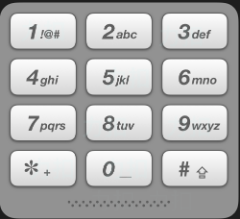

## 算法
算法（Algorithm）是指解题方案的准确而完整的描述，是一系列解决问题的清晰指令，算法代表着用系统的方法描述解决问题的策略机制。也就是说，能够对一定规范的输入，在有限时间内获得所要求的输出。如果一个算法有缺陷，或不适合于某个问题，执行这个算法将不会解决这个问题。不同的算法可能用不同的时间、空间或效率来完成同样的任务。一个算法的优劣可以用空间复杂度与时间复杂度来衡量。
算法中的指令描述的是一个计算，当其运行时能从一个初始状态和（可能为空的）初始输入开始，经过一系列有限而清晰定义的状态，最终产生输出并停止于一个终态。一个状态到另一个状态的转移不一定是确定的。随机化算法在内的一些算法，包含了一些随机输入。
### 排序
排序是计算机内经常进行的一种操作，其目的是将一组“无序”的记录序列调整为“有序”的记录序列。分内部排序和外部排序，若整个排序过程不需要访问外存便能完成，则称此类排序问题为内部排序。反之，若参加排序的记录数量很大，整个序列的排序过程不可能在内存中完成，则称此类排序问题为外部排序。内部排序的过程是一个逐步扩大记录的有序序列长度的过程。
### 二分查找
二分查找也称折半查找（Binary Search），它是一种效率较高的查找方法。但是，折半查找要求线性表必须采用顺序存储结构，而且表中元素按关键字有序排列。
### 递归
程序调用自身的编程技巧称为递归（ recursion）。递归做为一种算法在程序设计语言中广泛应用。 一个过程或函数在其定义或说明中有直接或间接调用自身的一种方法，它通常把一个大型复杂的问题层层转化为一个与原问题相似的规模较小的问题来求解，递归策略只需少量的程序就可描述出解题过程所需要的多次重复计算，大大地减少了程序的代码量。递归的能力在于用有限的语句来定义对象的无限集合。一般来说，递归需要有边界条件、递归前进段和递归返回段。当边界条件不满足时，递归前进；当边界条件满足时，递归返回。
### 广度优先搜索
宽度优先搜索算法（又称广度优先搜索）是最简便的图的搜索算法之一，这一算法也是很多重要的图的算法的原型。Dijkstra单源最短路径算法和Prim最小生成树算法都采用了和宽度优先搜索类似的思想。其别名又叫BFS，属于一种盲目搜寻法，目的是系统地展开并检查图中的所有节点，以找寻结果。换句话说，它并不考虑结果的可能位置，彻底地搜索整张图，直到找到结果为止。
### 深度优先搜索
深度优先搜索是一种在开发爬虫早期使用较多的方法。它的目的是要达到被搜索结构的叶结点(即那些不包含任何超链的HTML文件) 。在一个HTML文件中，当一个超链被选择后，被链接的HTML文件将执行深度优先搜索，即在搜索其余的超链结果之前必须先完整地搜索单独的一条链。深度优先搜索沿着HTML文件上的超链走到不能再深入为止，然后返回到某一个HTML文件，再继续选择该HTML文件中的其他超链。当不再有其他超链可选择时，说明搜索已经结束。
### 回溯
回溯法也可以叫做回溯搜索法，它是一种搜索的方式。

回溯是递归的副产品，只要有递归就会有回溯。

所以以下讲解中，回溯函数也就是递归函数，指的都是一个函数。


回溯法，一般可以解决如下几种问题：

- 组合问题：N个数里面按一定规则找出k个数的集合
- 切割问题：一个字符串按一定规则有几种切割方式
- 子集问题：一个N个数的集合里有多少符合条件的子集
- 排列问题：N个数按一定规则全排列，有几种排列方式
- 棋盘问题：N皇后，解数独等等

#### 77. 组合
给定两个整数 n 和 k，返回范围 [1, n] 中所有可能的 k 个数的组合。

你可以按 任何顺序 返回答案。

 

示例 1：
```
输入：n = 4, k = 2
输出：
[
  [2,4],
  [3,4],
  [2,3],
  [1,2],
  [1,3],
  [1,4],
]
```
示例 2：
```
输入：n = 1, k = 1
输出：[[1]]
```

提示：
```
1 <= n <= 20
1 <= k <= n
```
来源：力扣（LeetCode）
链接：https://leetcode-cn.com/problems/combinations
著作权归领扣网络所有。商业转载请联系官方授权，非商业转载请注明出处。

```js
/**
 * @param {number} n
 * @param {number} k
 * @return {number[][]}
 */
var combine = function (n, k) {
    // 回溯法， 又被称为“ 试探法”。 解决问题时， 每进行一步， 都是抱着试试看的态度，
    // 如果发现当前选择并不是最好的， 或者这么走下去肯定达不到目标，
    // 立刻做回退操作重新选择。
    // 这种走不通就回退再走的方法就是回溯法。
    let res = [],
        path = []
    // 闭包保存res的值
    var recursive = (n, k, startIndex) => {
        if (path.length === k) {
            // 浅拷贝有问题
            // 当 数组是一维数组时，扩展运算符可以进行完全深拷贝 ，改变拷贝后数组的值并不会影响拷贝源的值。
            // res.push(path)
            // 需要深拷贝
            res.push([...path])
            return
        }
        for (let i = startIndex; i <= n - (k - path.length) + 1; i++) {
            path.push(i)
            recursive(n, k, i + 1)
            // 回溯操作
            path.pop()
        }
    }
    recursive(n, k, 1)
    return res
};
```

[[↑] 回到顶部](#awsome-knowledge-back-end)

---

#### 216. 组合总和 III
找出所有相加之和为 n 的 k 个数的组合。组合中只允许含有 1 - 9 的正整数，并且每种组合中不存在重复的数字。

说明：
```
所有数字都是正整数。
解集不能包含重复的组合。 
```
示例 1:
```
输入: k = 3, n = 7
输出: [[1,2,4]]
```
示例 2:
```
输入: k = 3, n = 9
输出: [[1,2,6], [1,3,5], [2,3,4]]
```
来源：力扣（LeetCode）
链接：https://leetcode-cn.com/problems/combination-sum-iii
著作权归领扣网络所有。商业转载请联系官方授权，非商业转载请注明出处。

```js
/**
 * @param {number} k
 * @param {number} n
 * @return {number[][]}
 */
// var combinationSum3 = function (k, n) {
//     /**
//      * 回溯法求解
//      * 1.确定参数
//      * 2.终止条件
//      * 3.遍历单层处理
//      */
//     let res = [],
//         path = [],
//         sum = 0
//     var recursive = (k, n, startIndex) => {
//         if (path.length === k && sum === n) {
//             // 深拷贝，不影响被拷贝的变量
//             res.push([...path])
//             return
//         }
//         // 未剪枝
//         for (let i = startIndex; i <= 9; i++) {
//             sum += i
//             path.push(i)
//             recursive(k, n, i + 1)
//             // 回溯
//             sum -= i
//             path.pop(i)
//         }
//     }
//     recursive(k, n, 1)
//     return res
// };

var combinationSum3 = function (k, n) {
    /**
     * 剪枝优化
     * 总和大于目标值 sum>n 没必要继续，剪枝
     * 遍历次数不需要9次，比如此题中：8和9
     * path.length 目前路径长度
     * k - path.length 还需要的数的长度
     * 9 - (k - path.length) + 1 最大能遍历到的数
     */

    let res = [],
        path = [],
        sum = 0
    var recursive = (k, n, startIndex) => {
        // 剪枝
        if (sum > n) return
        if (path.length === k && sum === n) {
            // 深拷贝，不影响被拷贝的变量
            res.push([...path])
            return
        }
        // 剪枝优化    
        for (let i = startIndex; i <= 9 - (k - path.length) + 1; i++) {
            sum += i
            path.push(i)
            recursive(k, n, i + 1)
            // 回溯
            sum -= i
            path.pop(i)
        }
    }
    recursive(k, n, 1)
    return res
};
```

[[↑] 回到顶部](#awsome-knowledge-back-end)

---

#### 17. 电话号码的字母组合
给定一个仅包含数字 2-9 的字符串，返回所有它能表示的字母组合。答案可以按 任意顺序 返回。

给出数字到字母的映射如下（与电话按键相同）。注意 1 不对应任何字母。



 

示例 1：
```
输入：digits = "23"
输出：["ad","ae","af","bd","be","bf","cd","ce","cf"]
```
示例 2：
```
输入：digits = ""
输出：[]
```
示例 3：
```
输入：digits = "2"
输出：["a","b","c"]
``` 

提示：
```
0 <= digits.length <= 4
digits[i] 是范围 ['2', '9'] 的一个数字。
```
来源：力扣（LeetCode）
链接：https://leetcode-cn.com/problems/letter-combinations-of-a-phone-number
著作权归领扣网络所有。商业转载请联系官方授权，非商业转载请注明出处。

```js
/**
 * @param {string} digits
 * @return {string[]}
 */
var letterCombinations = function (digits) {
    /**
     * 回溯法
     * 1.确定参数
     * 2.终止条件
     * 3.遍历单层处理数据
     */
    if (digits.length === 0) return []
    let res = [],
        path = [],
        // 字母数字映射
        map = {
            0: "", // 0
            1: "", // 1
            2: "abc", // 2
            3: "def", // 3
            4: "ghi", // 4
            5: "jkl", // 5
            6: "mno", // 6
            7: "pqrs", // 7
            8: "tuv", // 8
            9: "wxyz", // 9
        },
        // 递归的深度
        len = digits.length
    var recursive = (n, k, startIndex) => {
        if (path.length === k) {
            res.push(path.join(''))
            return
        }
        // n[startIndex] 取字符串中的数字
        // map[n[startIndex]] 根据字符串中的数字取出字母
        // 遍历这些字母
        for (let i of map[n[startIndex]]) {
            path.push(i)
            recursive(n, k, startIndex + 1)
            // 回溯
            path.pop()
        }
    }
    recursive(digits, len, 0)
    return res
};
```

[[↑] 回到顶部](#awsome-knowledge-back-end)

---

#### 39. 组合总和
给定一个无重复元素的正整数数组 candidates 和一个正整数 target ，找出 candidates 中所有可以使数字和为目标数 target 的唯一组合。

candidates 中的数字可以无限制重复被选取。如果至少一个所选数字数量不同，则两种组合是唯一的。 

对于给定的输入，保证和为 target 的唯一组合数少于 150 个。

 

示例 1：
```
输入: candidates = [2,3,6,7], target = 7
输出: [[7],[2,2,3]]
```
示例 2：
```
输入: candidates = [2,3,5], target = 8
输出: [[2,2,2,2],[2,3,3],[3,5]]
```
示例 3：
```
输入: candidates = [2], target = 1
输出: []
```
示例 4：
```
输入: candidates = [1], target = 1
输出: [[1]]
```
示例 5：
```
输入: candidates = [1], target = 2
输出: [[1,1]]
```

提示：
```
1 <= candidates.length <= 30
1 <= candidates[i] <= 200
candidate 中的每个元素都是独一无二的。
1 <= target <= 500
```
来源：力扣（LeetCode）
链接：https://leetcode-cn.com/problems/combination-sum
著作权归领扣网络所有。商业转载请联系官方授权，非商业转载请注明出处。
```js
/**
 * @param {number[]} candidates
 * @param {number} target
 * @return {number[][]}
 */
var combinationSum = function (candidates, target) {
    /**
     * 回溯法求解-不剪枝
     * 1.确定递归的参数
     * 2.结束的条件
     * 3.遍历每层数据进行处理
     */
    let res = [],
        path = [],
        sum = 0
    var recursive = (n, k, startIndex) => {
        if (sum > k) return
        if (sum === k) {
            res.push([...path])
            return
        }
        // 遍历原数组
        for (let i = startIndex; i < n.length; i++) {
            // 每个数试错相加
            sum += n[i]
            path.push(n[i])
            // i不需要加一，可以重复，包括自己
            recursive(n, k, i)
            // 回溯
            sum -= n[i]
            path.pop()
        }
    }
    recursive(candidates, target, 0)
    return res
};
// Accepted
// 170/170 cases passed (112 ms)
// Your runtime beats 12.15 % of javascript submissions
// Your memory usage beats 71.03 % of javascript submissions (40.1 MB)

// var combinationSum = function (candidates, target) {
//     /**
//      * 回溯法求解-剪枝优化（有问题）
//      * 3.遍历每层数据 如果sum+当前值大于目标值，就没必要往下递归了
//      */
//     let res = [],
//         path = [],
//         sum = 0
//     var recursive = (n, k, startIndex) => {
//         if (sum > k) return
//         if (sum === k) {
//             res.push([...path])
//             return
//         }
//         // 遍历原数组
//         for (let i = startIndex; i < n.length && sum + n[i] <= k; i++) {
//             // 每个数试错相加
//             sum += n[i]
//             path.push(n[i])
//             // i不需要加一，可以重复，包括自己
//             recursive(n, k, i)
//             // 回溯
//             sum -= n[i]
//             path.pop()
//         }
//     }
//     recursive(candidates, target, 0)
//     return res
// };
// console.log(combinationSum([2,7,6,3,5,1], 9))
// [[2,2,2,2],[2,3,3],[3,5]]
```
[[↑] 回到顶部](#awsome-knowledge-back-end)

---

#### 40. 组合总和 II
给定一个数组 candidates 和一个目标数 target ，找出 candidates 中所有可以使数字和为 target 的组合。

candidates 中的每个数字在每个组合中只能使用一次。

注意：解集不能包含重复的组合。 

 

示例 1:
```
输入: candidates = [10,1,2,7,6,1,5], target = 8,
输出:
[
[1,1,6],
[1,2,5],
[1,7],
[2,6]
]
```
示例 2:
```
输入: candidates = [2,5,2,1,2], target = 5,
输出:
[
[1,2,2],
[5]
]
```

提示:
```
1 <= candidates.length <= 100
1 <= candidates[i] <= 50
1 <= target <= 30
```
来源：力扣（LeetCode）
链接：https://leetcode-cn.com/problems/combination-sum-ii
著作权归领扣网络所有。商业转载请联系官方授权，非商业转载请注明出处。
```js
/**
 * @param {number[]} candidates
 * @param {number} target
 * @return {number[][]}
 */
// var combinationSum2 = function (candidates, target) {
//     /**
//      * 回溯法求解（使用used有问题）
//      * 1.确定递归的参数
//      * 2.结束的条件
//      * 3.遍历每层数据进行处理
//      * 
//      * 
//      * 这道题目，元素在同一组合内是可以重复的，但是两个组合不能重复。
//      * 要去重的是同一树层上的“使用过”，同一树枝上的都是一个组合里的元素，不用去重。
//      * 
//      * 先进行排序，将相同的数放在附近
//      * 再去重
//      * 
//      * 不明白查阅：
//      * https://programmercarl.com/0040.%E7%BB%84%E5%90%88%E6%80%BB%E5%92%8CII.html#%E5%9B%9E%E6%BA%AF%E4%B8%89%E9%83%A8%E6%9B%B2
//      */
//     let res = [],
//         path = [],
//         sum = 0,
//         // true 同一树枝的使用过
//         // false 同一树层的使用过
//         used = []
//     candidates.sort((a, b) => a - b)
//     var recursive = (n, k, startIndex, used) => {
//         if (sum > k) return
//         if (sum === k) {
//             res.push([...path])
//             return
//         }
//         // 遍历原数组
//         for (let i = startIndex; i < n.length; i++) {
//             // 如果是同一树层n[[i - 1]]上"使用过"，并且前后两值相等，跳出这层递归
//             // i要从1开始，i-1可以从0开始
//             if (used[i - 1] === false && i > 0 && n[i] === n[i - 1]) continue
//             // 每个数试错相加
//             sum += n[i]
//             path.push(n[i])
//             // 同一树枝上
//             used[i] = true
//             recursive(n, k, i + 1, used)
//             // 同一树层
//             used[i] = false
//             // 回溯
//             sum -= n[i]
//             path.pop()
//         }
//     }
//     recursive(candidates, target, 0, used)
//     return res
// };
var combinationSum2 = function (candidates, target) {
    /**
     * 回溯法求解
     */
    let res = [],
        path = [],
        sum = 0
    candidates.sort((a, b) => a - b)
    var recursive = (n, k, startIndex) => {
        if (sum > k) return
        if (sum === k) {
            res.push([...path])
            return
        }
        // 遍历原数组
        for (let i = startIndex; i < n.length; i++) {
            // 每个节点是能使用一次，不同节点不能重复
            if (i > startIndex && n[i] === n[i - 1]) continue
            // 每个数试错相加
            sum += n[i]
            path.push(n[i])
            recursive(n, k, i + 1)
            // 回溯
            sum -= n[i]
            path.pop()
        }
    }
    recursive(candidates, target, 0)
    return res
};
```
[[↑] 回到顶部](#awsome-knowledge-back-end)

---

### 动态规划
动态规划(dynamic programming)是运筹学的一个分支，是求解决策过程(decision process)最优化的数学方法。20世纪50年代初美国数学家R.E.Bellman等人在研究多阶段决策过程(multistep decision process)的优化问题时，提出了著名的最优化原理(principle of optimality)，把多阶段过程转化为一系列单阶段问题，利用各阶段之间的关系，逐个求解，创立了解决这类过程优化问题的新方法——动态规划。1957年出版了他的名著《Dynamic Programming》，这是该领域的第一本著作。
##### 70. 爬楼梯
假设你正在爬楼梯。需要 n 阶你才能到达楼顶。
每次你可以爬 1 或 2 个台阶。你有多少种不同的方法可以爬到楼顶呢？
注意：给定 n 是一个正整数。
示例 1：
```
输入： 2
输出： 2
解释： 有两种方法可以爬到楼顶。
1.  1 阶 + 1 阶
2.  2 阶
```
示例 2：
```
输入： 3
输出： 3
解释： 有三种方法可以爬到楼顶。
1.  1 阶 + 1 阶 + 1 阶
2.  1 阶 + 2 阶
3.  2 阶 + 1 阶
```
<pre> 
/*
 * @lc app=leetcode.cn id=70 lang=javascript
 *
 * [70] 爬楼梯
 */
/**
 * @param {number} n
 * @return {number}
 */
var climbStairs = function (n) {
    let sum
    if (n === 2) {
        return 2
    } else if (n === 3) {
        return 3
    }
    sum = climbStairs(n - 1) + climbStairs(n - 2)
    return sum
}


RangeError: Maximum call stack size exceeded
</pre> 
这种方法，虽然也是递归但是爆栈了
正确如下：
1. 递归方法
2. 结果值就等于前两者相加
3. 最初始值给定，并申明一个数组存放结果，递归的中产生的值放入数组就不会爆栈，最后返回数组中的n位置上的值。
4. 如果递归调用出现问题，可以考虑采取循环的方式来解决，将需要的数据在关键的调用点保存下来使用。简 单的说，就是用自己的数据保存方法来代替系统递归调用产生的堆栈数据。

```js
/*
 * @lc app=leetcode.cn id=70 lang=javascript
 *
 * [70] 爬楼梯
 */
/**
 * @param {number} n
 * @return {number}
 */
var climbStairs = function (n) {
    if (n === 0) return 0
    if (n === 1) return 1
    if (n === 2) return 2
    let arr = [0, 1, 2]
    for (let i = 3; i <= n; i++) {
        arr[i] = arr[i - 1] + arr[i - 2]
    }
    return arr[n]
}
```

<pre>
✔ Accepted
  ✔ 45/45 cases passed (60 ms)
  ✔ Your runtime beats 98.63 % of javascript submissions
  ✔ Your memory usage beats 41.12 % of javascript submissions (33.7 MB)
</pre>

[[↑] 回到顶部](#awsome-knowledge-back-end)

---
### 贪心算法
贪心算法（又称贪婪算法）是指，在对问题求解时，总是做出在当前看来是最好的选择。也就是说，不从整体最优上加以考虑，他所做出的是在某种意义上的局部最优解。
贪心算法不是对所有问题都能得到整体最优解，关键是贪心策略的选择，选择的贪心策略必须具备无后效性，即某个状态以前的过程不会影响以后的状态，只与当前状态有关。
#### 455. 分发饼干
假设你是一位很棒的家长，想要给你的孩子们一些小饼干。但是，每个孩子最多只能给一块饼干。

对每个孩子 i，都有一个胃口值 g[i]，这是能让孩子们满足胃口的饼干的最小尺寸；并且每块饼干 j，都有一个尺寸 s[j] 。如果 s[j] >= g[i]，我们可以将这个饼干 j 分配给孩子 i ，这个孩子会得到满足。你的目标是尽可能满足越多数量的孩子，并输出这个最大数值。

 
示例 1:
```
输入: g = [1,2,3], s = [1,1]
输出: 1
解释: 
你有三个孩子和两块小饼干，3个孩子的胃口值分别是：1,2,3。
虽然你有两块小饼干，由于他们的尺寸都是1，你只能让胃口值是1的孩子满足。
所以你应该输出1。
```
示例 2:
```
输入: g = [1,2], s = [1,2,3]
输出: 2
解释: 
你有两个孩子和三块小饼干，2个孩子的胃口值分别是1,2。
你拥有的饼干数量和尺寸都足以让所有孩子满足。
所以你应该输出2.
``` 

提示：
```
1 <= g.length <= 3 * 104
0 <= s.length <= 3 * 104
1 <= g[i], s[j] <= 231 - 1
```

来源：力扣（LeetCode）
链接：https://leetcode-cn.com/problems/assign-cookies
著作权归领扣网络所有。商业转载请联系官方授权，非商业转载请注明出处。

```js
/**
 * @param {number[]} g 胃口
 * @param {number[]} s 饼干
 * @return {number}
 */
var findContentChildren = function (g, s) {
    /**
     * 贪心算法求解：
     * 先考虑饼干
     * 1.小饼干先满足小胃口
     */
    // g = g.sort((a, b) => a - b)
    // s = s.sort((a, b) => a - b)
    // // 喂饱的人数
    // let count = 0,
    //     startIndex = 0
    // for (let i = 0; i < s.length; i++) {
    //     if (s[i] >= g[startIndex]) {
    //         count++
    //         startIndex++
    //     }
    // }
    // return count

    /**
     * 先考虑胃口
     * 2.大饼干先满足大胃口
     */
    g = g.sort((a, b) => b - a)
    s = s.sort((a, b) => b - a)
    let count = 0,
        startIndex = 0
    for (let i = 0; i < g.length; i++) {
        if (g[i] <= s[startIndex]) {
            count++
            startIndex++
        }
    }
    return count
};
```

[[↑] 回到顶部](#awsome-knowledge-back-end)

---
#### 376. 摆动序列
如果连续数字之间的差严格地在正数和负数之间交替，则数字序列称为 摆动序列 。第一个差（如果存在的话）可能是正数或负数。仅有一个元素或者含两个不等元素的序列也视作摆动序列。

例如， [1, 7, 4, 9, 2, 5] 是一个 摆动序列 ，因为差值 (6, -3, 5, -7, 3) 是正负交替出现的。

相反，[1, 4, 7, 2, 5] 和 [1, 7, 4, 5, 5] 不是摆动序列，第一个序列是因为它的前两个差值都是正数，第二个序列是因为它的最后一个差值为零。
子序列 可以通过从原始序列中删除一些（也可以不删除）元素来获得，剩下的元素保持其原始顺序。

给你一个整数数组 nums ，返回 nums 中作为 摆动序列 的 最长子序列的长度 。

 

示例 1：
```
输入：nums = [1,7,4,9,2,5]
输出：6
解释：整个序列均为摆动序列，各元素之间的差值为 (6, -3, 5, -7, 3) 。
```
示例 2：
```
输入：nums = [1,17,5,10,13,15,10,5,16,8]
输出：7
解释：这个序列包含几个长度为 7 摆动序列。
其中一个是 [1, 17, 10, 13, 10, 16, 8] ，各元素之间的差值为 (16, -7, 3, -3, 6, -8) 。
```
示例 3：
```
输入：nums = [1,2,3,4,5,6,7,8,9]
输出：2
``` 

提示：
```
1 <= nums.length <= 1000
0 <= nums[i] <= 1000
``` 

进阶：你能否用 O(n) 时间复杂度完成此题?

来源：力扣（LeetCode）
链接：https://leetcode-cn.com/problems/wiggle-subsequence
著作权归领扣网络所有。商业转载请联系官方授权，非商业转载请注明出处。

```js
/**
 * @param {number[]} nums
 * @return {number}
 */
var wiggleMaxLength = function (nums) {
    /**
     * 贪心算法求解
     */
    // 上一个区间的差值
    let preDiff = 0,
    // 当前区间的差值
        curDiff = 0,
        // 最开始节点
        res = 1
    for (let i = 0; i < nums.length; i++) {
        curDiff = nums[i + 1] - nums[i]
        // 当前区间的差值 和 前一个区间的差值 正负相反
        if (curDiff > 0 && preDiff <= 0 || (curDiff < 0 && preDiff >= 0)) {
            res++
            preDiff = curDiff
        }
    }
    return res
};
```

[[↑] 回到顶部](#awsome-knowledge-back-end)

---
#### 53. 最大子数组和
给你一个整数数组 nums ，请你找出一个具有最大和的连续子数组（子数组最少包含一个元素），返回其最大和。

子数组 是数组中的一个连续部分。

示例 1：
```
输入：nums = [-2,1,-3,4,-1,2,1,-5,4]
输出：6
解释：连续子数组 [4,-1,2,1] 的和最大，为 6 。
```
示例 2：
```
输入：nums = [1]
输出：1
```
示例 3：
```
输入：nums = [5,4,-1,7,8]
输出：23
``` 

提示：
```
1 <= nums.length <= 105
-104 <= nums[i] <= 104
```

进阶：如果你已经实现复杂度为 O(n) 的解法，尝试使用更为精妙的 分治法 求解。

来源：力扣（LeetCode）
链接：https://leetcode-cn.com/problems/maximum-subarray
著作权归领扣网络所有。商业转载请联系官方授权，非商业转载请注明出处。

```js
/**
 * @param {number[]} nums
 * @return {number}
 */
var maxSubArray = function (nums) {
    /**
     * 暴力求解（有问题：通不过测试）
     */
    // 全局属性 Infinity 是一个数值，表示无穷大。
    // let res = -Infinity,
    //     count = 0
    // for (let i = 0; i < nums.length; i++) {
    //     // 每次重置开始位置，都应该置空count
    //     count = 0
    //     for (let j = i; j < nums.length; j++) {
    //         count += nums[j]
    //         res = count > res ? count : res
    //     }
    // }
    // return res
    /**
     * 贪心算法
     */
    let res = -Infinity,
        count = 0
    for (let i = 0; i < nums.length; i++) {
        count += nums[i]
        // 取区间累计的最大值（相当于不断确定最大子序终止位置）
        res = count > res ? count : res
        // 和<0重置为0，因为任何数和负数相加总是越来越小
        if (count < 0) {
            count = 0
        }
    }
    return res
};
```

[[↑] 回到顶部](#awsome-knowledge-back-end)

---
#### 122. 买卖股票的最佳时机 II
给定一个数组 prices ，其中 prices[i] 是一支给定股票第 i 天的价格。

设计一个算法来计算你所能获取的最大利润。你可以尽可能地完成更多的交易（多次买卖一支股票）。

注意：你不能同时参与多笔交易（你必须在再次购买前出售掉之前的股票）。

 

示例 1:
```
输入: prices = [7,1,5,3,6,4]
输出: 7
解释: 在第 2 天（股票价格 = 1）的时候买入，在第 3 天（股票价格 = 5）的时候卖出, 这笔交易所能获得利润 = 5-1 = 4 。
     随后，在第 4 天（股票价格 = 3）的时候买入，在第 5 天（股票价格 = 6）的时候卖出, 这笔交易所能获得利润 = 6-3 = 3 。
```
示例 2:
```
输入: prices = [1,2,3,4,5]
输出: 4
解释: 在第 1 天（股票价格 = 1）的时候买入，在第 5 天 （股票价格 = 5）的时候卖出, 这笔交易所能获得利润 = 5-1 = 4 。
     注意你不能在第 1 天和第 2 天接连购买股票，之后再将它们卖出。因为这样属于同时参与了多笔交易，你必须在再次购买前出售掉之前的股票。
```
示例 3:
```
输入: prices = [7,6,4,3,1]
输出: 0
解释: 在这种情况下, 没有交易完成, 所以最大利润为 0。
```

提示：
```
1 <= prices.length <= 3 * 104
0 <= prices[i] <= 104
```
来源：力扣（LeetCode）
链接：https://leetcode-cn.com/problems/best-time-to-buy-and-sell-stock-ii
著作权归领扣网络所有。商业转载请联系官方授权，非商业转载请注明出处。

```js
/**
 * @param {number[]} prices
 * @return {number}
 */
var maxProfit = function (prices) {
    /**
     * 贪心算法求解
     * 
     * 上升区间的头节点买入,尾节点卖出最赚
     */
    let curDiff = 0,
        res = 0
    for (let i = 0; i < prices.length; i++) {
        // 当前区间的盈利
        curDiff = prices[i + 1] - prices[i]
        // 如果盈利是正的,就相加
        if (curDiff > 0) {
            res += curDiff
        }
    }
    return res
};
```

[[↑] 回到顶部](#awsome-knowledge-back-end)

---
#### 55. 跳跃游戏
给定一个非负整数数组 nums ，你最初位于数组的 第一个下标 。

数组中的每个元素代表你在该位置可以跳跃的最大长度。

判断你是否能够到达最后一个下标。

 

示例 1：
```
输入：nums = [2,3,1,1,4]
输出：true
解释：可以先跳 1 步，从下标 0 到达下标 1, 然后再从下标 1 跳 3 步到达最后一个下标。
```
示例 2：
```
输入：nums = [3,2,1,0,4]
输出：false
解释：无论怎样，总会到达下标为 3 的位置。但该下标的最大跳跃长度是 0 ， 所以永远不可能到达最后一个下标。
``` 

提示：
```
1 <= nums.length <= 3 * 104
0 <= nums[i] <= 105
```
来源：力扣（LeetCode）
链接：https://leetcode-cn.com/problems/jump-game
著作权归领扣网络所有。商业转载请联系官方授权，非商业转载请注明出处。

```js
/**
 * @param {number[]} nums
 * @return {boolean}
 */
var canJump = function (nums) {
    if (nums.length === 1) return true
    let count = 0
    // 每次移动只能在count的范围内移动，每移动一个元素，count得到该元素数值（新的覆盖范围）的补充，让i继续移动下去。
    // 而count每次只取 max(该元素数值补充后的范围, count本身范围)。
    for (let i = 0; i <= count; i++) {
        // 当前位置加上当前值 和 count 取谁最大
        count = Math.max(i + nums[i], count)
        // 如果 count 大于数组长度，那就是全覆盖了
        if (count >= nums.length - 1) return true
    }
    return false
};
```

[[↑] 回到顶部](#awsome-knowledge-back-end)

---
#### 45. 跳跃游戏 II
给你一个非负整数数组 nums ，你最初位于数组的第一个位置。

数组中的每个元素代表你在该位置可以跳跃的最大长度。

你的目标是使用最少的跳跃次数到达数组的最后一个位置。

假设你总是可以到达数组的最后一个位置。

 

示例 1:
```
输入: nums = [2,3,1,1,4]
输出: 2
解释: 跳到最后一个位置的最小跳跃数是 2。
     从下标为 0 跳到下标为 1 的位置，跳 1 步，然后跳 3 步到达数组的最后一个位置。
```
示例 2:
```
输入: nums = [2,3,0,1,4]
输出: 2
``` 

提示:
```
1 <= nums.length <= 104
0 <= nums[i] <= 1000
```
来源：力扣（LeetCode）
链接：https://leetcode-cn.com/problems/jump-game-ii
著作权归领扣网络所有。商业转载请联系官方授权，非商业转载请注明出处。

```js
/**
 * @param {number[]} nums
 * @return {number}
 */
var jump = function (nums) {
    if (nums.length === 1) return 0
    // 步长
    let step = 0,
        // 当前最远距离
        currentDistance = 0,
        //    下一步最远距离
        nextDistance = 0
    for (let i = 0; i < nums.length; i++) {
        // 更新下一步覆盖最远距离下标
        nextDistance = Math.max(nextDistance, i + nums[i])
        // 如果已经达到最远距离
        if (i === currentDistance) {
            // 如果没有到达终点
            if (currentDistance < nums.length - 1) {
                step++
                currentDistance = nextDistance
            } else {
                break
            }
        }
    }
    return step
};
```

[[↑] 回到顶部](#awsome-knowledge-back-end)

---
### 位操纵
位操作是程序设计中对位模式按位或二进制数的一元和二元操作. 在许多古老的微处理器上, 位运算比加减运算略快, 通常位运算比乘除法运算要快很多. 在现代架构中, 情况并非如此:位运算的运算速度通常与加法运算相同（仍然快于乘法运算）。
### 脑筋急转弯
### 设计
### 分而治之
### 扫描线
### 记忆化
### 极小化极大
### 有序地图
### 随机
### 拒绝采样
### 蓄水池采样
### 滑动窗口
### 拓扑排序
### 两个指针
### 并查集
### 未知 
##### 395. 至少有K个重复字符的最长子串

找到给定字符串（由小写字符组成）中的最长子串 T ， 要求 T 中的每一字符出现次数都不少于 k 。输出 T 的长度。

示例 1:
```
输入:
s = "aaabb", k = 3

输出:
3

最长子串为 "aaa" ，其中 'a' 重复了 3 次。
```
示例 2:
```
输入:
s = "ababbc", k = 2

输出:
5

最长子串为 "ababb" ，其中 'a' 重复了 2 次， 'b' 重复了 3 次。
```


<pre> 
/*
 * @lc app=leetcode.cn id=395 lang=javascript
 *
 * [395] 至少有K个重复字符的最长子串
 */
/**
 * @param {string} s
 * @param {number} k
 * @return {number}
 */
var longestSubstring = function (s, k) {
    let map = new Map()
    let j = 1
    let total = 0
    for (let i = 0; i < s.length; i++) {
        if (map.size === 0) {
            map.set(s[i], j)
        } else
        if (map.has(s[i])) {
            j = map.get(s[i])
            j++
            map.set(s[i], j)

        } else {
            j = 1
            map.set(s[i], j)
        }
    }
    map.forEach(item => {
        if (item >= k) {
            total += item
        }
    })
    return total
};
</pre> 

[[↑] 回到顶部](#awsome-knowledge-back-end)

---
